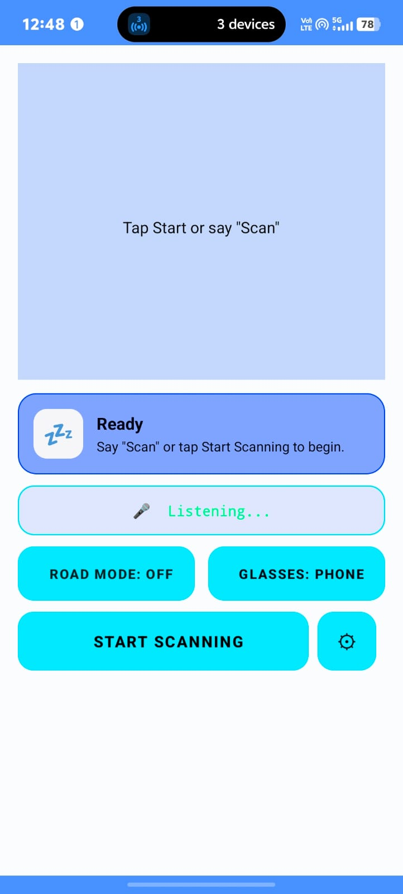
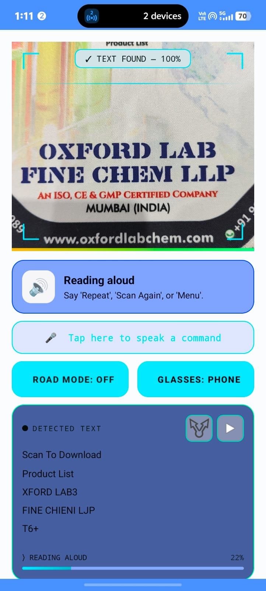
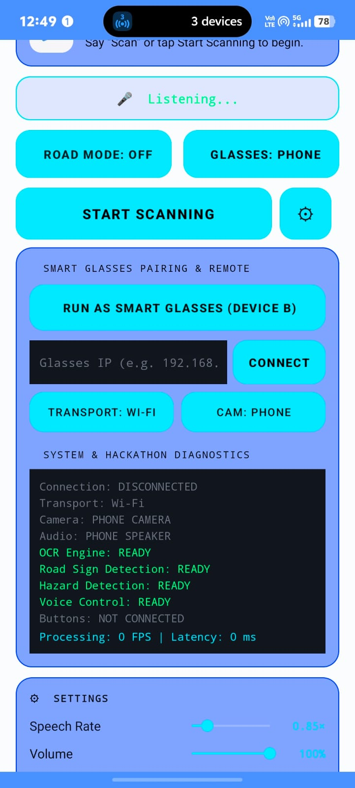
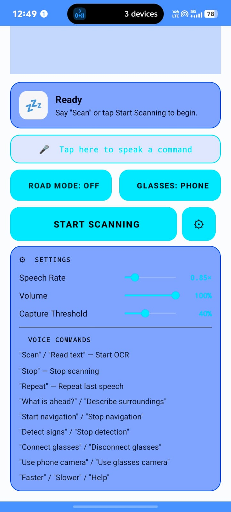
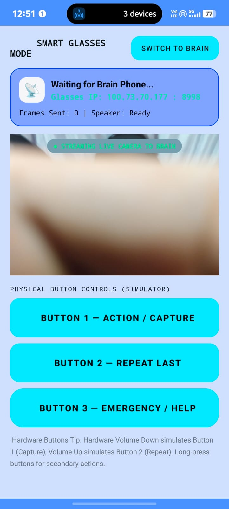
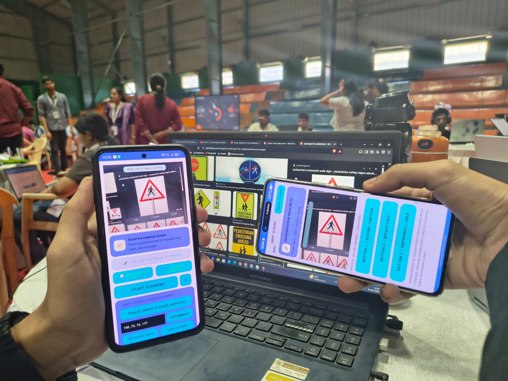

#  VisionRead

### AI-Powered Assistive Vision System for the Visually Impaired

**VisionRead** is an AI-powered assistive technology system designed to help visually impaired people understand and interact with their surroundings.

The system uses a **camera-based wearable device as the "eyes"** and an **Android smartphone as the "brain"**. The camera captures the environment, while the smartphone processes the visual information using AI/ML and communicates important information to the user through **voice feedback**.

> **Glasses see. Phone thinks. Voice guides.**

---

##  Vision

VisionRead aims to make everyday environments more accessible to visually impaired people by providing real-time information about:

*  Printed text
*  Road signs
*  People
*  Vehicles
*  Obstacles and hazards
*  Directional/environmental information

The long-term goal is to build lightweight smart glasses containing only the necessary sensors and camera, while the user's smartphone performs the computationally intensive AI processing.

---

#  System Architecture

```text
                         VISIONREAD
                             │
              ┌──────────────┴──────────────┐
              │                             │
           GLASSES                        PHONE
           "EYES"                        "BRAIN"
              │                             │
          ┌───┴───┐                   ┌─────┴─────┐
          │Camera │                   │ VisionRead│
          │Buttons│                   │ Core      │
          │Audio  │                   └─────┬─────┘
          └───┬───┘                         │
              │                       ┌─────┴─────┐
              │                       │ AI/ML     │
              │                       │ Pipeline  │
              │                       └─────┬─────┘
              │                             │
              │             ┌───────────────┼───────────────┐
              │             │               │               │
              │            OCR        Road Signs         Hazards
              │             │               │               │
              │             └───────────────┼───────────────┘
              │                             │
              │                       Decision Engine
              │                             │
              │                       Alert Manager
              │                             │
              └─────────────────────────────┤
                                            ↓
                                      Voice Output
                                            │
                                            ↓
                                          USER
```

---

#  Key Features

##  Text Recognition

VisionRead can capture printed text using the smartphone camera and convert it into machine-readable text.

The detected text can then be spoken to the user using **Text-to-Speech (TTS)**.

```text
Camera
   ↓
Image Capture
   ↓
OCR
   ↓
Text
   ↓
Text-to-Speech
   ↓
User hears the text
```

---

##  Road Sign Detection

VisionRead is designed to identify important road and traffic signs.

Examples include:

* Stop
* No Entry
* Speed Limit
* Pedestrian Crossing
* Turn indicators
* Warning signs

Detected signs can be converted into concise audio notifications.

```text
Road Sign
    ↓
Object Detection
    ↓
Sign Classification
    ↓
Context Analysis
    ↓
Voice Alert
```

---

##  Hazard Detection

The system is designed to identify potentially dangerous objects and obstacles in the user's path.

Potential detections include:

*  Vehicles
*  Pedestrians
*  Bicycles
*  Obstacles
*  Road barriers
*  Road hazards

Instead of continuously describing everything visible to the camera, VisionRead uses a **priority-based alert system** so that important information can be communicated first.

---

#  Intelligent Voice Alerts

VisionRead is designed around **audio-first interaction**.

Rather than requiring the user to look at a screen, important information is communicated through speech.

Example:

```text
"Stop sign ahead."

"Vehicle approaching from the right."

"Person approximately three meters ahead."

"Text detected. Reading now."

"Pedestrian crossing ahead."
```

The system can prioritize alerts according to their importance.

```text
CRITICAL
   ↓
SAFETY HAZARD
   ↓
ROAD SIGN
   ↓
NAVIGATION
   ↓
TEXT
   ↓
GENERAL INFORMATION
```

---

#  Voice Control

VisionRead is designed to support hands-free interaction.

Possible commands include:

```text
"Read this"
"Scan"
"Repeat"
"Stop"
"Describe surroundings"
"Read sign"
"Start navigation"
```

This allows the user to interact with the system without depending on a touchscreen.

---

#  Glasses + Phone Architecture

A major design principle of VisionRead is **separating sensing from computation**.

### Glasses — "Eyes"

The future wearable device is intended to contain:

* Camera
* Microphone
* Physical buttons
* Audio output
* Wireless communication

The glasses do **not** need to perform heavy AI computation.

### Phone — "Brain"

The smartphone performs:

* Image processing
* OCR
* Object detection
* Road-sign detection
* Hazard analysis
* Context analysis
* Decision making
* Text-to-Speech
* Voice recognition

This makes the wearable hardware simpler, lighter and potentially more power efficient.

---

#  Device Communication

During development and demonstration, a second Android phone can be used to simulate the glasses.

```text
        PHONE A
       "GLASSES"
           │
           │
      Wi-Fi / Bluetooth
           │
           ▼
        PHONE B
        "BRAIN"
           │
           ▼
        AI/ML
           │
           ▼
      Voice Output
```

This allows the complete wearable concept to be demonstrated without requiring custom hardware.

### Communication Responsibilities

**Glasses device**

```text
Camera Frames
     ↓
Wireless Transport
```

**Brain device**

```text
Receive Frame
     ↓
Process Frame
     ↓
AI Detection
     ↓
Generate Alert
     ↓
Send/Play Audio
```

---

#  Software Architecture

The application is organized around independent components.

```text
VisionReadEngine
│
├── Camera Manager
│
├── OCR Engine
│
├── Road Sign Detector
│
├── Hazard Detector
│
├── Object Detector
│
├── Spatial Analyzer
│
├── Decision Engine
│
├── Alert Manager
│
├── Voice Command Manager
│
├── Speech Manager
│
└── Communication Manager
```

This modular architecture allows individual components to be improved without rewriting the entire application.

---

#  Technology Stack

| Technology                   | Purpose                                 |
| ---------------------------- | --------------------------------------- |
| **Kotlin / Java**            | Android application development         |
| **Android Studio**           | Development environment                 |
| **CameraX**                  | Camera access and frame processing      |
| **Google ML Kit**            | OCR/text recognition                    |
| **TensorFlow Lite / ONNX**   | On-device AI inference                  |
| **Android SpeechRecognizer** | Voice commands                          |
| **Android Text-to-Speech**   | Audio feedback                          |
| **Wi-Fi / TCP**              | High-bandwidth device communication     |
| **Bluetooth**                | Low-bandwidth control and communication |
| **Android SDK**              | Core platform                           |

> Technologies listed above represent the intended VisionRead architecture. Individual capabilities may be implemented incrementally.

---

#  Edge AI & Power Efficiency

VisionRead is designed with **edge computing** in mind.

Instead of continuously sending images to a remote cloud server:

```text
Camera
  ↓
Phone
  ↓
On-device AI
  ↓
Decision
  ↓
Voice
```

This can provide:

* Lower latency
* Reduced dependence on internet connectivity
* Better privacy
* Faster response
* Potentially lower communication power consumption

The wearable itself can remain lightweight by delegating intensive computation to the smartphone.

---

#  Privacy

VisionRead is intended to prioritize local processing wherever possible.

The system architecture is designed to minimize unnecessary transmission of visual data to external servers.

Future versions can implement:

* On-device AI inference
* Local OCR
* Local object detection
* Encrypted device communication
* Temporary frame buffers
* Automatic deletion of processed frames

---

## 📱 Screenshots

### Home Screen


### Normal Reading Screen


### Pairing Panel


### Settings Panel


### Smart Glass Mode


### Brain and Eye (Paired devices)


---

#  Project Structure

```text
VisionRead/
│
├── app/
│   └── Android application
│
├── docs/
│   ├── ARCHITECTURE.md
│   ├── AI_PIPELINE.md
│   ├── COMMUNICATION.md
│   ├── HAZARD_DETECTION.md
│   └── ROAD_SIGN_DETECTION.md
│
├── glasses/
│   └── Wearable device documentation
│
├── models/
│   └── AI model documentation
│
├── screenshots/
│   └── Application screenshots
│
├── README.md
├── LICENSE
└── .gitignore
```

---

#  Getting Started

## Requirements

* Android Studio
* Android SDK
* Android device or emulator
* Camera-enabled Android device
* Internet connection for initial dependency/model setup

## Installation

Clone the repository:

```bash
git clone https://github.com/akabhinavkumar10-crypto/Vision__Read.git
```

Open the project in **Android Studio**.

Allow Gradle to synchronize the project and install the required dependencies.

Connect an Android device or start an emulator.

Then run:

```text
Run ▶
```

on the Android Studio toolbar.

---

#  Development Setup

For the current prototype, the simplest setup is:

```text
Android Phone
     │
     ├── Camera
     ├── OCR
     ├── AI processing
     ├── Voice recognition
     └── Text-to-Speech
```

For the two-device demonstration:

```text
Android Phone A
      │
      │ Wi-Fi / Bluetooth
      ▼
Android Phone B
      │
      ├── AI processing
      ├── OCR
      ├── Detection
      └── Voice output
```

---

#  Development Roadmap

### Phase 1 — Foundation

* [x] Android application
* [x] Camera integration
* [x] Text recognition
* [x] Text-to-Speech
* [x] Basic voice interaction

### Phase 2 — Environmental Understanding

* [ ] Object detection
* [ ] Road-sign detection
* [ ] Hazard detection
* [ ] Distance estimation
* [ ] Direction estimation

### Phase 3 — Intelligence

* [ ] Context-aware alerts
* [ ] Alert prioritization
* [ ] Scene understanding
* [ ] Reduced false alerts
* [ ] Multi-object reasoning

### Phase 4 — Wearable Integration

* [ ] Glasses camera prototype
* [ ] Phone ↔ glasses communication
* [ ] Wireless camera streaming
* [ ] Physical control buttons
* [ ] Wearable audio output

### Phase 5 — Optimization

* [ ] Model quantization
* [ ] Reduced latency
* [ ] Battery optimization
* [ ] Offline operation
* [ ] Background processing optimization

---

#  Hackathon Prototype

For the hackathon demonstration, two Android phones can represent the final system.

### Device 1 — Glasses

```text
Camera
   ↓
Phone
   ↓
Wi-Fi
```

### Device 2 — Brain

```text
Wi-Fi
   ↓
VisionRead
   ↓
OCR / Detection
   ↓
Decision Engine
   ↓
TTS
   ↓
User
```

This demonstrates the same architecture that can later be implemented using actual smart-glasses hardware.

---

#  Future Vision

The long-term goal of VisionRead is to evolve from a smartphone application into a complete assistive wearable platform.

```text
                FUTURE VISIONREAD

                  Smart Glasses
                       │
                 Camera + Sensors
                       │
                       ▼
                  Smartphone
                  AI "Brain"
                       │
          ┌────────────┼────────────┐
          ▼            ▼            ▼
         OCR       Environment    Navigation
                    Analysis
          │            │            │
          └────────────┼────────────┘
                       ▼
                 Context Engine
                       │
                       ▼
                 Audio Guidance
                       │
                       ▼
                     USER
```

Future versions could incorporate:

* Depth cameras
* GPS
* IMU sensors
* Advanced object detection
* Scene understanding
* Navigation assistance
* Multilingual OCR
* Offline AI
* Personalized alert settings
* Custom wearable hardware

---

#  Disclaimer

VisionRead is an assistive technology prototype.

AI-based detection can make mistakes and should **not be treated as a replacement for a user's existing mobility aids, trained assistance, or independent safety judgment**.

Safety-critical functionality should be thoroughly tested before real-world deployment.

---

#  License

This project is currently intended as an open-source development project.

See the `LICENSE` file for the applicable license terms.

---

#  Project

**VisionRead**

> **Giving machines eyes so people can experience the world more independently.**

⭐ If you find the project interesting, consider starring the repository.

## 📖 Story Mode (Gemini TTS)

VisionRead now includes an optional Story Mode for books, stories, and long-form text. Normal scanning continues to use the existing on-device OCR and Android Text-to-Speech pipeline. Story Mode sends the detected page text to Gemini TTS and plays the generated audiobook-style narration locally.

### Setup

1. Create a Gemini API key in Google AI Studio.
2. In your local `local.properties`, add:

```properties
GEMINI_API_KEY=YOUR_GEMINI_API_KEY_HERE
```

3. Sync Gradle and run the app.
4. Turn on **Story Mode**, then scan a book page.

Story Mode uses `gemini-3.1-flash-tts-preview` and requests expressive narration with natural pacing, pauses, emphasis, and dialogue-aware delivery. Gemini TTS currently returns raw 24 kHz, mono, 16-bit PCM audio, which VisionRead wraps as WAV for Android playback.

> **Security note:** a Gemini key embedded in a mobile APK can be extracted. The direct client-side API integration here is intended for a hackathon/prototype. A production release should put Gemini behind a server-side service and keep the key off the device.
